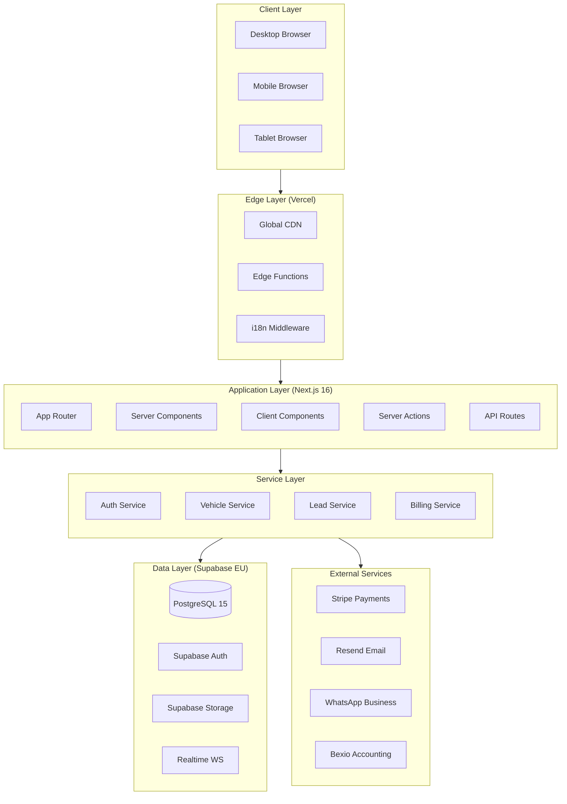
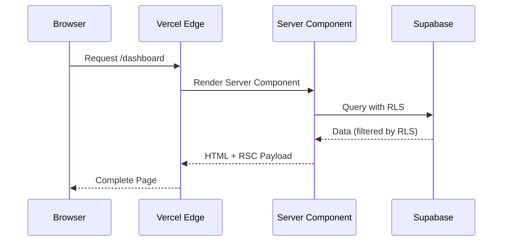
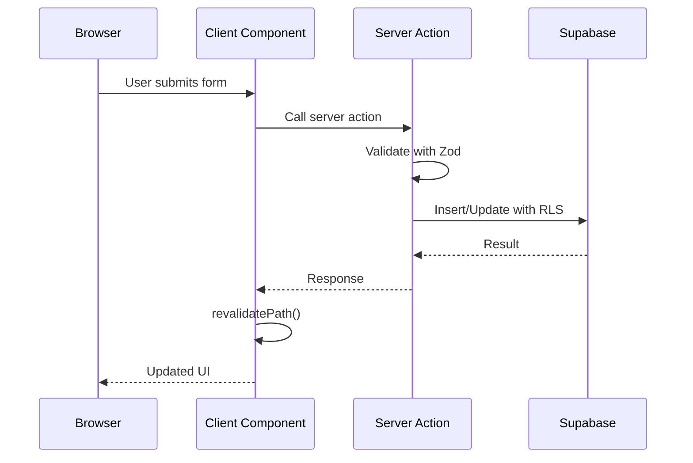
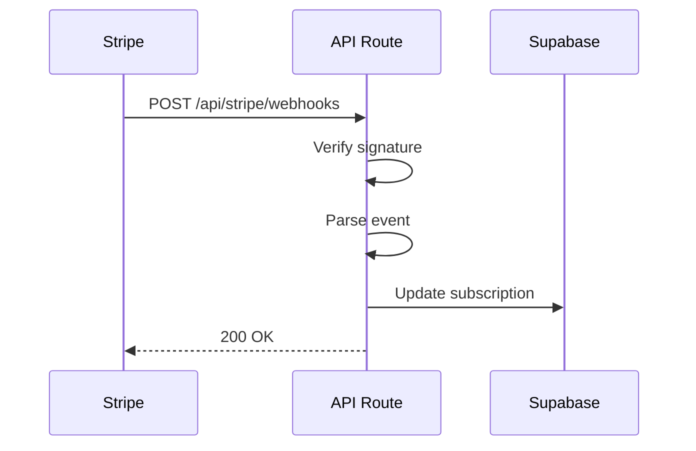
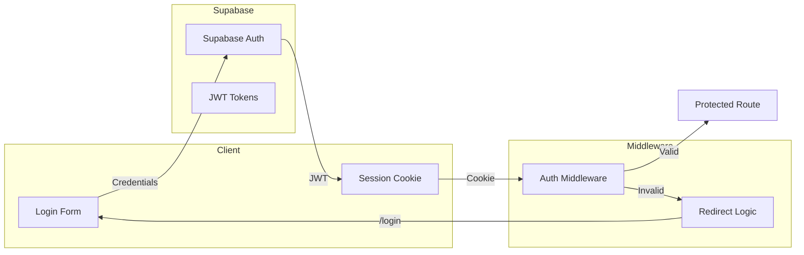

# System Architecture

> System design, data flow, and architectural decisions

---

## 🏗️ High-Level Architecture



---

## 📁 Application Structure

```
dealer-os/
├── src/
│   ├── app/                      # Next.js App Router
│   │   ├── [locale]/             # i18n locale prefix
│   │   │   ├── (auth)/           # Auth pages (login, register)
│   │   │   ├── (marketing)/      # Public pages (landing, pricing)
│   │   │   └── dashboard/        # Protected app
│   │   │       ├── page.tsx      # Dashboard home
│   │   │       ├── fahrzeuge/    # Vehicles
│   │   │       ├── leads/        # Lead management
│   │   │       ├── kunden/       # Customers
│   │   │       ├── offerten/     # Quotes
│   │   │       ├── rechnungen/   # Invoices
│   │   │       ├── statistik/    # Analytics
│   │   │       └── einstellungen/# Settings
│   │   └── api/                  # API routes
│   │       ├── stripe/           # Payment webhooks
│   │       ├── webhooks/         # External webhooks
│   │       ├── export/           # Data exports
│   │       └── notifications/    # Email notifications
│   │
│   ├── components/               # React components
│   │   ├── ui/                   # shadcn/ui components
│   │   ├── forms/                # Form components
│   │   ├── dashboard/            # Dashboard widgets
│   │   └── ...
│   │
│   ├── lib/                      # Utilities
│   │   ├── supabase/             # Supabase clients
│   │   ├── stripe/               # Stripe utilities
│   │   └── utils.ts              # Helper functions
│   │
│   ├── types/                    # TypeScript types
│   │   └── database.types.ts     # Supabase generated types
│   │
│   └── i18n/                     # Internationalization
│       └── routing.ts            # Locale routing
│
├── supabase/
│   ├── migrations/               # Database migrations (15 files)
│   └── schema.sql                # Base schema
│
├── e2e/                          # Playwright E2E tests
│   ├── auth.spec.ts
│   ├── vehicles.spec.ts
│   └── ... (13 test files)
│
├── messages/                     # i18n translation files
│   ├── de.json                   # German (primary)
│   ├── en.json                   # English
│   ├── fr.json                   # French
│   ├── it.json                   # Italian
│   └── sr.json                   # Serbian
│
└── public/                       # Static assets
```

---

## 🔄 Data Flow Patterns

### Server Component Pattern (Primary)



### Server Action Pattern (Mutations)



### Webhook Pattern (External Events)



---

## 🏛️ Multi-Tenant Architecture

### Tenant Isolation via RLS

```sql
-- Every data table has dealer_id
-- RLS ensures users only see their data

CREATE POLICY "Users can view own vehicles" ON vehicles
  FOR SELECT USING (
    dealer_id IN (
      SELECT dealer_id FROM team_members 
      WHERE user_id = auth.uid()
    )
  );
```

### Tenant Hierarchy

```
User (auth.users)
  └── Team Member (team_members)
        └── Dealer (dealers)
              ├── Vehicles
              ├── Leads
              ├── Customers
              ├── Quotes
              ├── Invoices
              └── Settings
```

---

## 🔐 Authentication Architecture



---

## 🌐 Internationalization Architecture

### URL-Based Routing

```
/de/dashboard     → German
/en/dashboard     → English
/fr/dashboard     → French
/it/dashboard     → Italian
/sr/dashboard     → Serbian
```

### Implementation

```typescript
// src/middleware.ts
import createMiddleware from 'next-intl/middleware';

export default createMiddleware({
  locales: ['de', 'en', 'fr', 'it', 'sr'],
  defaultLocale: 'de',
});
```

---

## 📊 Key Architectural Decisions

### ADR-001: Next.js App Router

**Decision:** Use Next.js 16 with App Router  
**Rationale:** 
- Server Components reduce bundle size
- Built-in streaming and suspense
- Better SEO with SSR
- Future-proof architecture

### ADR-002: Supabase over Custom Backend

**Decision:** Use Supabase BaaS  
**Rationale:**
- Instant auth, database, storage
- Row-level security built-in
- PostgreSQL (no vendor lock-in)
- Rapid development

### ADR-003: Multi-Tenant via RLS

**Decision:** Use PostgreSQL RLS for multi-tenancy  
**Rationale:**
- Security at database level
- No accidental data leaks
- Simple implementation
- Scalable pattern

### ADR-004: Server Actions for Mutations

**Decision:** Use Server Actions instead of API routes  
**Rationale:**
- Type-safe end-to-end
- Automatic revalidation
- Progressive enhancement
- Reduced boilerplate

---

## 🔄 State Management

### Server State

- **Server Components:** Direct database queries
- **Server Actions:** Mutations with revalidation

### Client State

- **React Hook Form:** Form state
- **URL State:** Filters, pagination (searchParams)
- **Local State:** UI state (useState)

*No global state management library needed (Redux, Zustand)*

---

## 📈 Future Architecture Considerations

### Planned Improvements

1. **Read Replicas:** For analytics queries
2. **Queue System:** For async tasks (exports, reports)
3. **Cache Layer:** Redis for session/frequent queries
4. **Event Sourcing:** For audit trail (if required)

### Scaling Strategy

```
Current: Single Supabase instance, Vercel Edge
    ↓
Growth: Connection pooling, read replicas
    ↓
Scale: Database sharding, microservices (if needed)
```

---

*Architecture based on actual codebase analysis - February 2025*
