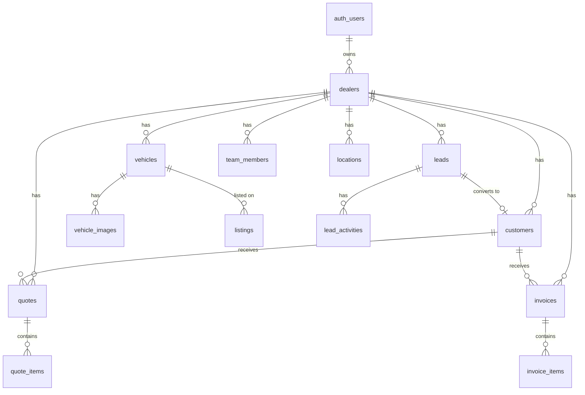

# Database Architecture

> Schema design, migrations, and data management

---

## 🗄️ Database Overview

| Aspect | Details |
|--------|---------|
| **Engine** | PostgreSQL 15 |
| **Provider** | Supabase |
| **Region** | EU (Frankfurt) |
| **Connection** | Pooled (Supavisor) |

---

## 📊 Schema Overview



---

## 📋 Table Definitions

### Core Tables

#### `dealers` (Tenants)
```sql
CREATE TABLE dealers (
  id UUID PRIMARY KEY DEFAULT uuid_generate_v4(),
  created_at TIMESTAMPTZ DEFAULT NOW(),
  updated_at TIMESTAMPTZ DEFAULT NOW(),
  
  -- Auth
  user_id UUID REFERENCES auth.users(id) ON DELETE CASCADE,
  
  -- Company Info
  company_name TEXT NOT NULL,
  contact_name TEXT NOT NULL,
  email TEXT NOT NULL,
  phone TEXT,
  
  -- Address
  street TEXT,
  zip TEXT,
  city TEXT,
  country TEXT DEFAULT 'CH',
  
  -- Business
  vehicle_count_estimate INT,
  subscription_plan TEXT DEFAULT 'beta',
  
  -- Status
  status TEXT DEFAULT 'pending'
);
```

#### `vehicles`
```sql
CREATE TABLE vehicles (
  id UUID PRIMARY KEY DEFAULT uuid_generate_v4(),
  created_at TIMESTAMPTZ DEFAULT NOW(),
  updated_at TIMESTAMPTZ DEFAULT NOW(),
  
  dealer_id UUID REFERENCES dealers(id) ON DELETE CASCADE NOT NULL,
  location_id UUID REFERENCES locations(id) ON DELETE SET NULL,
  
  -- Basic Info
  make TEXT NOT NULL,
  model TEXT NOT NULL,
  variant TEXT,
  
  -- Details
  first_registration DATE,
  mileage INT,
  fuel_type TEXT,
  transmission TEXT,
  power_kw INT,
  color TEXT,
  
  -- Pricing
  purchase_price DECIMAL(10,2),
  asking_price DECIMAL(10,2),
  
  -- Status
  status TEXT DEFAULT 'in_stock',
  
  -- Dates
  acquired_at DATE DEFAULT CURRENT_DATE,
  sold_at DATE,
  
  -- Other
  vin TEXT,
  description TEXT,
  internal_notes TEXT
);
```

#### `leads`
```sql
CREATE TABLE leads (
  id UUID PRIMARY KEY DEFAULT uuid_generate_v4(),
  created_at TIMESTAMPTZ DEFAULT NOW(),
  updated_at TIMESTAMPTZ DEFAULT NOW(),
  
  dealer_id UUID REFERENCES dealers(id) ON DELETE CASCADE NOT NULL,
  vehicle_id UUID REFERENCES vehicles(id) ON DELETE SET NULL,
  
  -- Contact Info
  first_name TEXT NOT NULL,
  last_name TEXT NOT NULL,
  email TEXT,
  phone TEXT,
  
  -- Source & Status
  source TEXT DEFAULT 'other',
  status TEXT DEFAULT 'new',
  
  -- Message
  message TEXT,
  
  -- Follow-up
  last_contact_at TIMESTAMPTZ,
  next_followup DATE,
  
  -- Notes
  notes TEXT
);
```

#### `customers`
```sql
CREATE TABLE customers (
  id UUID PRIMARY KEY DEFAULT uuid_generate_v4(),
  dealer_id UUID NOT NULL REFERENCES dealers(id) ON DELETE CASCADE,
  
  -- Type
  customer_type TEXT NOT NULL DEFAULT 'private',
  company_name TEXT,
  
  -- Personal
  salutation TEXT,
  first_name TEXT NOT NULL,
  last_name TEXT NOT NULL,
  
  -- Contact
  email TEXT,
  phone TEXT,
  mobile TEXT,
  
  -- Address
  street TEXT,
  postal_code TEXT,
  city TEXT,
  country TEXT DEFAULT 'CH',
  
  -- Integrations
  bexio_contact_id INTEGER,
  
  -- Reference
  lead_id UUID REFERENCES leads(id) ON DELETE SET NULL,
  
  -- Timestamps
  created_at TIMESTAMPTZ NOT NULL DEFAULT NOW(),
  updated_at TIMESTAMPTZ NOT NULL DEFAULT NOW()
);
```

### Multi-Tenant Tables

#### `team_members`
```sql
CREATE TABLE team_members (
  id UUID PRIMARY KEY DEFAULT gen_random_uuid(),
  dealer_id UUID NOT NULL REFERENCES dealers(id) ON DELETE CASCADE,
  user_id UUID NOT NULL REFERENCES auth.users(id) ON DELETE CASCADE,
  role team_role NOT NULL DEFAULT 'member', -- owner, admin, member, viewer
  invited_by UUID REFERENCES auth.users(id),
  invited_at TIMESTAMPTZ DEFAULT NOW(),
  accepted_at TIMESTAMPTZ,
  created_at TIMESTAMPTZ DEFAULT NOW(),
  updated_at TIMESTAMPTZ DEFAULT NOW(),
  UNIQUE(dealer_id, user_id)
);
```

#### `locations` (Multi-Site)
```sql
CREATE TABLE locations (
  id UUID PRIMARY KEY DEFAULT gen_random_uuid(),
  dealer_id UUID NOT NULL REFERENCES dealers(id) ON DELETE CASCADE,
  name TEXT NOT NULL,
  street TEXT,
  postal_code TEXT,
  city TEXT,
  country TEXT DEFAULT 'CH',
  phone TEXT,
  email TEXT,
  is_primary BOOLEAN DEFAULT FALSE,
  created_at TIMESTAMPTZ DEFAULT NOW()
);
```

---

## 📈 Indexes

```sql
-- Performance indexes
CREATE INDEX idx_vehicles_dealer ON vehicles(dealer_id);
CREATE INDEX idx_vehicles_status ON vehicles(status);
CREATE INDEX idx_leads_dealer ON leads(dealer_id);
CREATE INDEX idx_leads_status ON leads(status);
CREATE INDEX idx_customers_dealer ON customers(dealer_id);
CREATE INDEX idx_customers_email ON customers(dealer_id, email);
CREATE INDEX idx_team_members_dealer_id ON team_members(dealer_id);
CREATE INDEX idx_team_members_user_id ON team_members(user_id);
```

---

## 🔄 Migrations

### Migration Files (15 total)

| File | Description |
|------|-------------|
| `schema.sql` | Base schema |
| `001_update_leads_table.sql` | Lead improvements |
| `002_add_onboarding_completed.sql` | Onboarding flag |
| `002_add_notification_settings.sql` | Email preferences |
| `004_add_stripe_fields.sql` | Billing fields |
| `005_add_dashboard_config.sql` | Dashboard customization |
| `006_create_email_templates.sql` | Email templates |
| `007_create_customers_quotes_invoices.sql` | CRM module |
| `007_whatsapp_integration.sql` | WhatsApp config |
| `008_add_whatsapp_auto_reply.sql` | Auto-reply |
| `008_add_locations.sql` | Multi-location |
| `009_multi_user_teams.sql` | Team members |
| `20240101000000_create_lead_activities.sql` | Activity timeline |
| `20250218_bexio_integration.sql` | Bexio sync |
| `20250624_notification_settings_v2.sql` | Notification v2 |

### Running Migrations

```bash
# Via Supabase Dashboard
# SQL Editor → Run migration SQL

# Or via CLI
supabase db push
```

---

## 🔒 Row Level Security

### RLS Status

| Table | RLS Enabled | Policies |
|-------|-------------|----------|
| dealers | ✅ | 2 |
| vehicles | ✅ | 4 |
| vehicle_images | ✅ | 1 |
| leads | ✅ | 1 |
| customers | ✅ | 4 |
| quotes | ✅ | 4 |
| invoices | ✅ | 4 |
| team_members | ✅ | 4 |
| locations | ✅ | 4 |

---

## 💾 Backup & Recovery

### Automatic Backups (Supabase)

| Plan | Frequency | Retention |
|------|-----------|-----------|
| Free | Daily | 7 days |
| Pro | Daily | 30 days |
| Team | Daily + PITR | 30 days |

### Point-in-Time Recovery

Available on Supabase Pro+:
- Recover to any point within retention window
- Sub-second granularity

### Manual Backup

```sql
-- Export via pg_dump (from Supabase connection)
pg_dump -h db.xxx.supabase.co -U postgres -d postgres > backup.sql
```

### Data Export

```bash
# Via Supabase Dashboard
# Table Editor → Export → CSV

# Or via API
supabase db dump --file backup.sql
```

---

## 📊 Database Metrics

### Current Usage (Estimated)

| Metric | Value | Limit (Pro) |
|--------|-------|-------------|
| Database Size | ~100 MB | 8 GB |
| Connections | ~10 | 500 pooled |
| Tables | 15+ | Unlimited |
| Rows | ~10,000 | Unlimited |

### Connection Pooling

```
Supavisor (built-in):
- Transaction mode
- 500 connections pooled
- Automatic scaling
```

---

## 🔄 Data Lifecycle

### Soft Delete vs Hard Delete

| Table | Delete Type | Cascade |
|-------|-------------|---------|
| dealers | Hard | All related data |
| vehicles | Hard | Images, listings |
| leads | Hard | Activities |
| customers | Restrict | Block if quotes/invoices |

### Data Retention

| Data | Retention | Deletion |
|------|-----------|----------|
| Account data | Until deletion | On account delete |
| Vehicle data | Until deletion | On vehicle delete |
| Analytics | 30 days | Automatic |
| Logs | 7 days | Automatic |

---

## 📋 Schema Best Practices

### Applied Patterns

- ✅ UUID primary keys (globally unique)
- ✅ Timestamps on all tables (created_at, updated_at)
- ✅ Foreign keys with appropriate actions
- ✅ Enums for status fields
- ✅ Indexes on foreign keys and filters
- ✅ RLS on all tables

### Data Types

| Type | Usage |
|------|-------|
| UUID | All IDs |
| TIMESTAMPTZ | All timestamps (timezone-aware) |
| TEXT | Strings (flexible length) |
| INT | Mileage, counts |
| DECIMAL(10,2) | Prices |
| JSONB | Flexible config (dashboard_config) |

---

*Schema based on actual migrations - February 2025*
