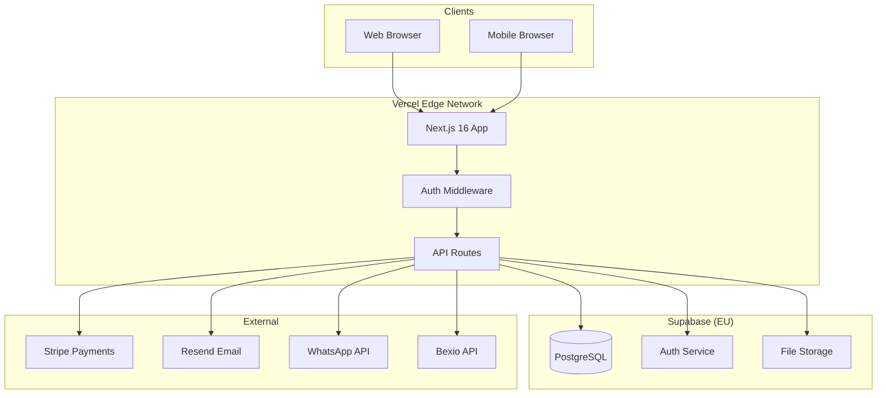

# 🔧 Technical Due Diligence

> Architecture, security, and infrastructure deep-dive

---

## 📋 Section Contents

| Document | Description |
|----------|-------------|
| [ARCHITECTURE.md](./ARCHITECTURE.md) | System design, Mermaid diagrams |
| [TECH_STACK.md](./TECH_STACK.md) | Next.js, TypeScript, Supabase, Vercel |
| [SECURITY.md](./SECURITY.md) | Auth, RLS, encryption, OWASP |
| [DATABASE.md](./DATABASE.md) | Schema, migrations, backup |
| [API.md](./API.md) | Endpoints, webhooks, rate limiting |
| [INFRASTRUCTURE.md](./INFRASTRUCTURE.md) | Vercel, Supabase, CDN |
| [CI_CD.md](./CI_CD.md) | GitHub Actions, testing, deployment |
| [SCALABILITY.md](./SCALABILITY.md) | Performance, load, bottlenecks |
| [CODE_QUALITY.md](./CODE_QUALITY.md) | TypeScript, linting, test coverage |
| [TECHNICAL_DEBT.md](./TECHNICAL_DEBT.md) | Known issues, roadmap |

---

## 🎯 Technical Highlights

| Area | Status | Notes |
|------|--------|-------|
| **Modern Stack** | ✅ | Next.js 16, React 19, TypeScript 5 |
| **Type Safety** | ✅ | ~95% TypeScript coverage |
| **Testing** | ✅ | Playwright E2E, Vitest unit tests |
| **CI/CD** | ✅ | GitHub Actions → Vercel |
| **Security** | ✅ | RLS, JWT auth, encryption |
| **Scalability** | ✅ | Serverless, auto-scaling |
| **i18n** | ✅ | 5 languages (DE, EN, FR, IT, SR) |

---

## 🏗️ Architecture Overview

---

## 📊 Key Technical Metrics

### Codebase

| Metric | Value |
|--------|-------|
| **Lines of Code** | ~50,000+ |
| **TypeScript Coverage** | ~95% |
| **E2E Test Files** | 13 |
| **API Routes** | 30+ |
| **DB Tables** | 15+ |
| **Migrations** | 15 |

### Performance

| Metric | Target | Current |
|--------|--------|---------|
| **First Contentful Paint** | <1.5s | ✅ |
| **Time to Interactive** | <3s | ✅ |
| **Lighthouse Score** | >90 | ✅ |
| **Edge Response Time** | <100ms | ✅ |

---

## ✅ Technical Due Diligence Checklist

### Architecture
- [x] Modern, maintainable stack
- [x] Serverless architecture
- [x] Multi-tenant with RLS
- [x] Clear separation of concerns

### Security
- [x] Row-level security on all tables
- [x] JWT authentication
- [x] HTTPS everywhere
- [x] Encryption at rest & transit
- [x] Input validation (Zod)
- [ ] Penetration test (recommended)

### Quality
- [x] TypeScript throughout
- [x] ESLint configuration
- [x] E2E testing (Playwright)
- [x] Unit testing (Vitest)
- [x] CI/CD pipeline

### Scalability
- [x] Serverless auto-scaling
- [x] CDN for static assets
- [x] Database connection pooling
- [x] Image optimization

---

## 🔗 Quick Links

For detailed technical analysis:

1. Start with [ARCHITECTURE.md](./ARCHITECTURE.md) for system overview
2. Review [SECURITY.md](./SECURITY.md) for security deep-dive
3. Check [DATABASE.md](./DATABASE.md) for data model
4. See [TECHNICAL_DEBT.md](./TECHNICAL_DEBT.md) for known issues

---

*All information derived from actual codebase - February 2025*
