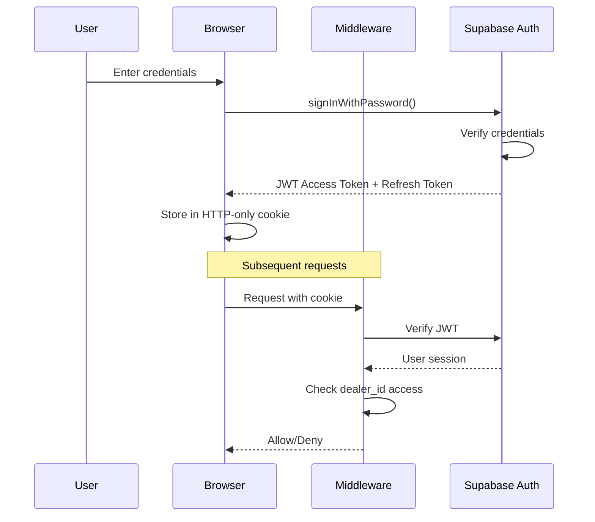

# Security Architecture

> Authentication, authorization, encryption, and security measures

---

## 🔐 Authentication System

### Authentication Flow



### Authentication Methods

| Method | Status | Use Case |
|--------|--------|----------|
| **Email/Password** | ✅ Active | Primary login |
| **Magic Link** | ✅ Active | Password reset |
| **OAuth (Google)** | 📋 Planned | Future option |

### Session Management

```typescript
// Cookie configuration
{
  name: 'sb-access-token',
  httpOnly: true,
  secure: true,           // HTTPS only
  sameSite: 'lax',        // CSRF protection
  maxAge: 60 * 60 * 24 * 7  // 7 days
}
```

### Token Security

| Token | Storage | Lifetime | Refresh |
|-------|---------|----------|---------|
| Access Token | HTTP-only cookie | 1 hour | Auto |
| Refresh Token | HTTP-only cookie | 7 days | On use |

---

## 🛡️ Row Level Security (RLS)

### RLS Implementation

**All tables have RLS enabled.** Every query is automatically filtered by user's tenant.

```sql
-- Enable RLS on all tables
ALTER TABLE dealers ENABLE ROW LEVEL SECURITY;
ALTER TABLE vehicles ENABLE ROW LEVEL SECURITY;
ALTER TABLE leads ENABLE ROW LEVEL SECURITY;
ALTER TABLE customers ENABLE ROW LEVEL SECURITY;
ALTER TABLE quotes ENABLE ROW LEVEL SECURITY;
ALTER TABLE invoices ENABLE ROW LEVEL SECURITY;
ALTER TABLE team_members ENABLE ROW LEVEL SECURITY;
-- ... and all other tables
```

### Policy Examples

#### Dealers Table
```sql
-- Users can only view their own dealer profile
CREATE POLICY "Users can view own dealer" ON dealers
  FOR SELECT USING (auth.uid() = user_id);

CREATE POLICY "Users can update own dealer" ON dealers
  FOR UPDATE USING (auth.uid() = user_id);
```

#### Vehicles Table
```sql
-- Full CRUD restricted to tenant
CREATE POLICY "Users can view own vehicles" ON vehicles
  FOR SELECT USING (
    dealer_id IN (
      SELECT dealer_id FROM team_members 
      WHERE user_id = auth.uid()
    )
  );

CREATE POLICY "Users can insert own vehicles" ON vehicles
  FOR INSERT WITH CHECK (
    dealer_id IN (
      SELECT dealer_id FROM team_members 
      WHERE user_id = auth.uid()
    )
  );

CREATE POLICY "Users can update own vehicles" ON vehicles
  FOR UPDATE USING (
    dealer_id IN (
      SELECT dealer_id FROM team_members 
      WHERE user_id = auth.uid()
    )
  );

CREATE POLICY "Users can delete own vehicles" ON vehicles
  FOR DELETE USING (
    dealer_id IN (
      SELECT dealer_id FROM team_members 
      WHERE user_id = auth.uid()
    )
  );
```

#### Team-Based Access
```sql
-- Team members see all team members in their dealer
CREATE POLICY "Users can view their team members" ON team_members
  FOR SELECT USING (
    dealer_id IN (
      SELECT dealer_id FROM team_members 
      WHERE user_id = auth.uid()
    )
    OR auth.uid() IN (SELECT user_id FROM platform_admins)
  );
```

### RLS Security Guarantees

| Guarantee | Implementation |
|-----------|----------------|
| **Data Isolation** | Every query filtered by dealer_id |
| **No Leakage** | Cannot access other tenants' data |
| **API Protection** | Even direct API calls filtered |
| **Admin Override** | Platform admins can access all |

---

## 🔒 Encryption

### Data in Transit

| Layer | Encryption | Protocol |
|-------|------------|----------|
| Browser → Vercel | TLS 1.3 | HTTPS |
| Vercel → Supabase | TLS 1.3 | HTTPS |
| Vercel → Stripe | TLS 1.3 | HTTPS |
| Vercel → Resend | TLS 1.3 | HTTPS |

### Data at Rest

| Data | Encryption | Provider |
|------|------------|----------|
| Database | AES-256 | Supabase (AWS) |
| File Storage | AES-256 | Supabase (AWS) |
| Backups | AES-256 | Supabase (AWS) |

### Sensitive Data

```typescript
// Bexio tokens encrypted before storage
import { encrypt, decrypt } from '@/lib/encryption';

// AES-256-GCM encryption
const encryptedToken = await encrypt(accessToken);
// Stored in database

const decryptedToken = await decrypt(encryptedToken);
// Used for API calls
```

### Password Handling

- **Algorithm:** bcrypt (via Supabase Auth)
- **Storage:** Never stored in plain text
- **Transmission:** Only over HTTPS
- **Reset:** Magic link (email)

---

## 🛡️ Input Validation

### Zod Schema Validation

```typescript
// Example: Vehicle creation schema
const vehicleSchema = z.object({
  make: z.string().min(1).max(100),
  model: z.string().min(1).max(100),
  variant: z.string().max(100).optional(),
  mileage: z.number().int().min(0).max(10000000),
  asking_price: z.number().min(0).max(100000000),
  vin: z.string().length(17).optional(),
  // ... all fields validated
});

// Used in server actions
export async function createVehicle(formData: FormData) {
  const parsed = vehicleSchema.safeParse(data);
  if (!parsed.success) {
    return { error: parsed.error.flatten() };
  }
  // Continue with valid data
}
```

### Validation Layers

| Layer | Method | Purpose |
|-------|--------|---------|
| **Client** | React Hook Form + Zod | UX feedback |
| **Server** | Zod in Server Actions | Security |
| **Database** | PostgreSQL constraints | Data integrity |

---

## 🔐 OWASP Top 10 Coverage

### A01: Broken Access Control ✅

- Row Level Security on all tables
- Auth middleware on all routes
- Role-based access (owner, admin, member, viewer)
- No direct object references exposed

### A02: Cryptographic Failures ✅

- TLS 1.3 everywhere
- AES-256 at rest
- bcrypt for passwords
- No sensitive data in logs

### A03: Injection ✅

- Parameterized queries (Supabase SDK)
- No raw SQL in application code
- Input validation with Zod
- XSS prevention via React

### A04: Insecure Design ✅

- Security by design (RLS)
- Threat modeling done
- Defense in depth

### A05: Security Misconfiguration ✅

- Vercel's secure defaults
- Supabase's secure defaults
- No exposed admin interfaces
- HTTPS enforced

### A06: Vulnerable Components ⚠️

- Regular dependency updates
- `npm audit` in CI
- No known vulnerabilities
- **Recommendation:** Add Dependabot

### A07: Authentication Failures ✅

- Supabase Auth (battle-tested)
- Rate limiting on auth endpoints
- Password requirements enforced
- Secure session management

### A08: Software Integrity ✅

- Vercel signed deployments
- npm lockfile committed
- CI/CD integrity checks

### A09: Logging & Monitoring ⚠️

- Basic Vercel logs
- Supabase query logs
- **Recommendation:** Add Sentry

### A10: SSRF ✅

- No user-controlled URLs fetched
- External APIs whitelisted

---

## 🛡️ XSS Prevention

### React's Built-in Protection

```jsx
// Automatic escaping
<p>{userInput}</p>  // Safe - escaped

// Dangerous patterns avoided
<div dangerouslySetInnerHTML={...} />  // Not used
```

### Content Security Policy

```typescript
// Headers set by Vercel/Next.js
Content-Security-Policy: 
  default-src 'self';
  script-src 'self' 'unsafe-inline' 'unsafe-eval' https://js.stripe.com;
  style-src 'self' 'unsafe-inline';
  img-src 'self' blob: data: https://*.supabase.co;
  connect-src 'self' https://*.supabase.co https://api.stripe.com;
```

---

## 🛡️ CSRF Prevention

### SameSite Cookies

```typescript
// All auth cookies have SameSite=Lax
{
  sameSite: 'lax'  // Prevents CSRF
}
```

### Server Actions

- Automatic CSRF tokens in Next.js
- No need for manual token management

---

## 🔑 Secrets Management

### Environment Variables

| Secret | Storage | Access |
|--------|---------|--------|
| `SUPABASE_SERVICE_ROLE_KEY` | Vercel Encrypted | Server only |
| `STRIPE_SECRET_KEY` | Vercel Encrypted | Server only |
| `STRIPE_WEBHOOK_SECRET` | Vercel Encrypted | Server only |
| `RESEND_API_KEY` | Vercel Encrypted | Server only |

### Public Variables

| Variable | Client Exposure |
|----------|-----------------|
| `NEXT_PUBLIC_SUPABASE_URL` | ✅ Safe to expose |
| `NEXT_PUBLIC_SUPABASE_ANON_KEY` | ✅ Safe to expose |
| `NEXT_PUBLIC_STRIPE_PUBLISHABLE_KEY` | ✅ Safe to expose |

### Secret Rotation

| Secret | Rotation | Method |
|--------|----------|--------|
| Supabase keys | On compromise | Generate new |
| Stripe keys | On compromise | Regenerate in dashboard |
| JWT secret | Never (Supabase managed) | N/A |

---

## 🔍 Security Audit Results

### Current Security Posture

| Area | Score | Notes |
|------|-------|-------|
| Authentication | A | Supabase Auth |
| Authorization | A | RLS on all tables |
| Encryption | A | TLS + AES-256 |
| Input Validation | A | Zod everywhere |
| XSS Protection | A | React + CSP |
| CSRF Protection | A | SameSite + Server Actions |
| Secrets Management | A | Vercel encrypted |
| Dependency Security | B | Manual checks |
| Logging/Monitoring | B | Basic setup |

### Recommendations

1. **Add Sentry** for error tracking and security alerts
2. **Enable Dependabot** for automated security updates
3. **Conduct penetration test** before major acquisition
4. **Add rate limiting** on API routes

---

## 📋 Security Checklist

- [x] Row Level Security on all tables
- [x] JWT authentication
- [x] HTTPS everywhere
- [x] Encryption at rest
- [x] Input validation (Zod)
- [x] XSS prevention (React)
- [x] CSRF protection (SameSite)
- [x] Secrets in environment variables
- [x] No sensitive data in client bundle
- [ ] Rate limiting (recommended)
- [ ] Security logging (Sentry - recommended)
- [ ] Penetration testing (recommended)

---

*Security analysis based on actual codebase - February 2025*
